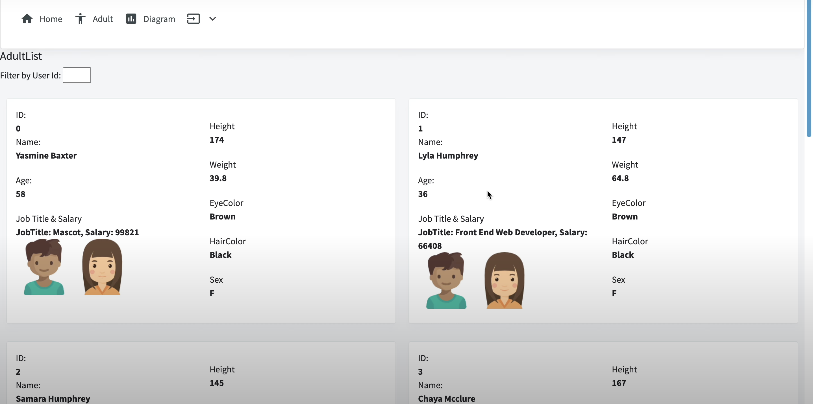
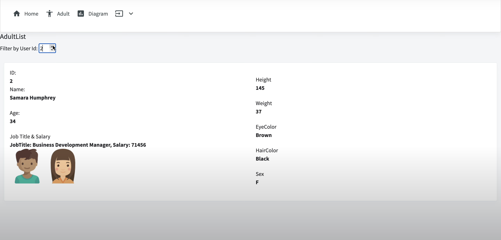
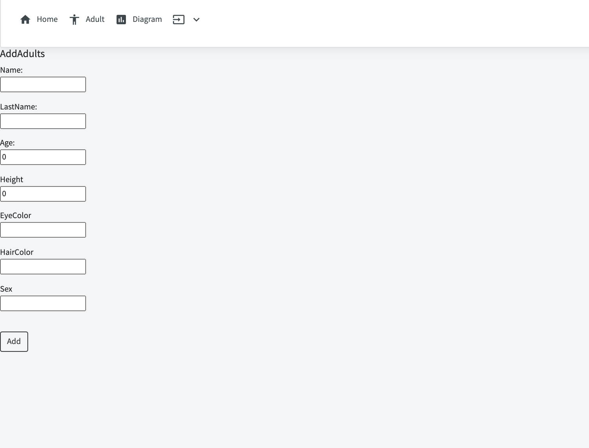

# Managing-Adults

This is an application for managing adults and view statistics. Using ASP.NET Core, Blazor & Radzen. Data is loaded and stored in a file using JSON format.

# Video

# ScreenShots

- Login

- Dashboard

- Filter

- Add Adult

